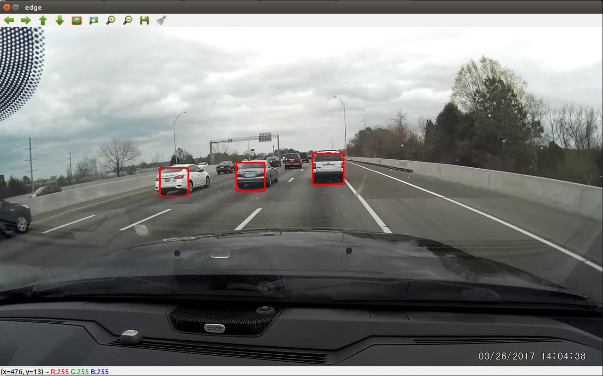

OpenCV Dashcam Car Detection
============================

This repository contains a Haar classifier trained specifically to recognize the 
rear ends of cars, along with the entire data set used to train it.

Classifier Training Data
------------------------

The classified was trained using stills from dashcam video, located in the positives and 
negatives directories. The stills in the negatives directory are from video footage containing 
no other cars on the road. There are currently around 450 negative images and 469 positive images
of vehicles. 

All of the positives were annotated with the bounds of the rear ends of cars in the frame 
using the `opencv_annotation` tool (stored in annotations.txt). 

A `.vec` file of samples was then created (24x24 sample size) using the `opencv_createsamples` 
tool.

The Haar cascade was then trained to an `acceptanceRatioBreakValue` of 1.0e-5.

Retraining the Classifier
-------------------------

If you would like to train your own classifier using this data set, you can follow the steps
outlined in `training_steps.sh`. I would not recommend simply running that script, instead run
one command at a time. 

You will need to delete the data in the `cascade_dir` first and change the numPos and numNeg input 
to `opencv_traincascade` if you add new samples. 

Example Python Code
-------------------

If you have OpenCV installed you can run the Python sample code using `python ./detect.py <path_to_video.mp4>`